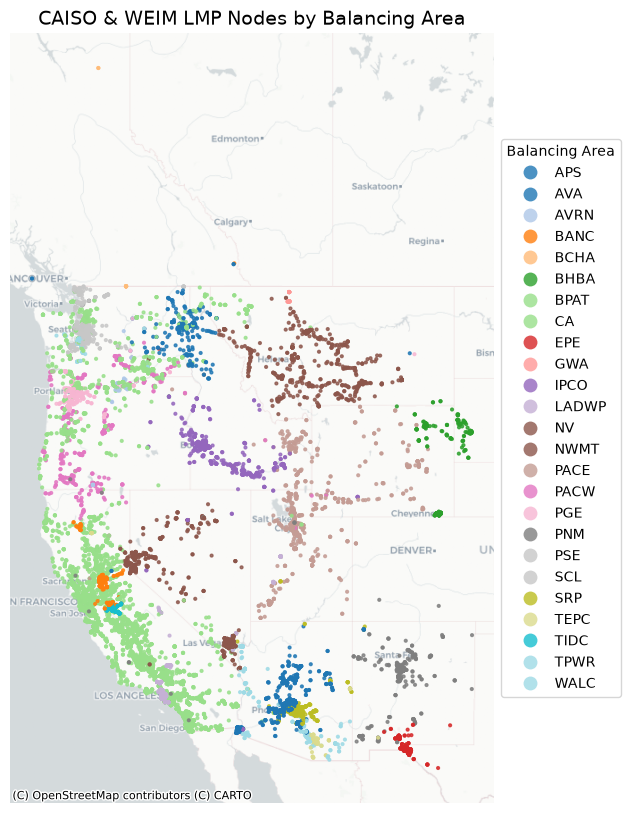

# LMP_Shapefile

A simple tool to create a shapefile and CSV file of Locational Marginal Pricing (LMP) Nodes in CAISO and the Western Energy Imbalance Market (WEIM).



## Repository Structure

- `CAISO_LMP.py`: The python script to fetch the coordinates and generate the outputs.
- `LMP_EDA.ipynb`: A jupyter notebook with basic summary statistics, and the code used to produce the map in this README. 
- `LMP/`: Folder containing the generated shapefile components (`caiso_lmp.shp`, `caiso_lmp.shx`, `caiso_lmp.dbf`, `caiso_lmp.prj`, `caiso_lmp.cpg`).
- `LMP_coordinates.csv`: CSV containing coordinates, balancing area, node ID, and node type.
- `pyproject.toml` / `uv.lock`: Project and dependency configuration files for `uv`.

## Prerequisites & Installation

This project is managed using [uv](https://github.com/astral-sh/uv). You can set up the project environment and install dependencies by following these steps:

1. Install `uv` if you haven't already:
   ```bash
   # On macOS/Linux
   curl -LsSf https://astral.sh/uv/install.sh | sh
   ```
2. Navigate to the project directory and run the `CAISO_LMP.py` script. `uv` will automatically manage the environment and install dependencies.

## Usage

Simply run the script using `uv run`:

```bash
uv run CAISO_LMP.py
```

This will fetch the data from the CAISO API and overwrite the `LMP_coordinates.csv` and the shapefile in the `LMP/` folder.

## Documentation

Start exploring the dataset with the `LMP_EDA` notebook! To launch a jupyter hub instance with all the required packages, simply run:

```bash
uv run jupyter notebook
```

---

## CAISO JSON Schema Reference

The data is parsed from a JSON response structured as follows:

```xml
<PriceContourMapDto>
  <l>
    <PriceContourLayer> <l>3</l>
      <m>
        <PriceContourMarker> # Each LMP node
          <c>
            <decimal>40.53944</decimal>    # Latitude
            <decimal>-111.89667</decimal>  # Longitude
          </c>
          <dc>52.81386</dc>                # Day-ahead energy $
          <dg>-3.52064</dg>                # Day-ahead congestion $
          <dk>0</dk>                       # Price color code
          <dl>-2.26571</dl>                # Day-ahead losses $
          <do>1</do>                       # Unique ordering key
          <dp>47.02751</dp>                # Day-ahead price $
          <fc>56.60284</fc>                # Fifteen Minute Market energy $
          <fg>0</fg>                       # FMM congestion $
          <fk>1</fk>
          <fl>-3.01127</fl>                # FMM losses $
          <fo>1</fo>
          <fp>53.59157</fp>                # FMM price $
          <n>118THSO_LNODER1</n>           # Node Name (node_id)
          <p>LOAD</p>                      # Load Type (node_type)
          <qc>73.41486</qc>                # Real-Time Dispatch energy $
          <qg>-0.0024</qg>                 # RTD congestion $
          <qk>4</qk>                  
          <ql>-3.94959</ql>                # RTD losses $
          <qo>1</qo>                  
          <qp>69.46287</qp>                # RTD price $
          <t>Node</t>
        </PriceContourMarker>
      </m>
    </PriceContourLayer>
  </l>
</PriceContourMapDto>
```
